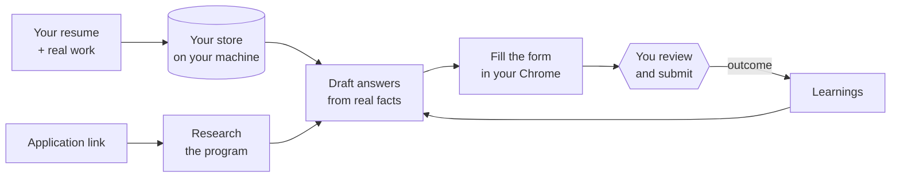

<div align="center">

```
      ·  ˙    ·    ˙  ·
   ˙    .-"""""""-.    ˙
  ·    /  ·  ˙  ·  \    ·
      |  (●)   (●)  |
   ˙   \     ▽     /    ˙
   ·    '-._____.-'    ·
      ˙  ·    ˙    ·  ˙
```

# Form Filler

**Paste an application link. Get the strongest *honest* version of you, filled in and waiting for your review.**

An application agent for [Claude Code](https://claude.com/claude-code) that researches each program, drafts every answer from your real work, and fills the form in your own browser — then stops before Submit.

[](LICENSE)
[](https://claude.com/claude-code)
[](#privacy)

[Install](#install) · [How it works](#how-it-works) · [Commands](#commands) · [Results](#does-it-work) · [Privacy](#privacy) · [FAQ](#faq)

</div>

---

## Why

Residencies, fellowships, accelerators, hackathons, popup villages — every form asks the same things about you, yet each program selects for something different. Most applicants don't lose on substance. They lose on presentation: buried numbers, generic framing, the wrong story for the room.

Form Filler fixes the presentation and refuses to touch the substance.

| | |
|---|---|
| **Grounded** | Every claim traces to a fact in your store. Nothing invented, nothing rounded up. |
| **Researched** | Reads what each program *actually* selects for, and who gets in, before writing a word. |
| **Asks, never guesses** | If an answer needs a fact it doesn't have, it tells you which one — instead of making it up. |
| **You submit** | It fills the form and stops. Submitting always takes your explicit go-ahead. |
| **Learns** | Every acceptance and rejection becomes a rule that every future draft is checked against. |

## Install

**Requires** [Claude Code](https://claude.com/claude-code) (any paid plan) and the [Claude in Chrome](https://claude.com/chrome) extension for form-filling.

```bash
git clone https://github.com/ajmerabaibhav/Form-Filler && Form-Filler/install.sh
```

Then, in Claude Code:

```
/apply setup
```

Hand it your resume, confirm a short table of basics (name, email, phone, links…) in one reply, and you're done. From then on it's just links.

<sub>Update any time with `cd Form-Filler && git pull && ./install.sh` — your saved data is never overwritten.</sub>

## How it works



1. **Store** — your resume becomes a set of plain files: a profile, one file per project with outcomes and numbers, and the basics every form asks for. Anything inferred rather than stated is flagged and unusable until you confirm it.
2. **Research** — for each program it works out what's really being selected for, the language the program uses, and the backgrounds of people who got in, then picks the one angle that makes *you* rare and valued there.
3. **Draft** — every essay answer leads with something concrete, fits the word limit exactly (counted, not estimated), and comes with a one-line note on why that framing beats the generic one.
4. **Fill** — boilerplate from your basics, essays from the drafts, resume uploaded to CV fields. Knows the quirks of Google Forms, Typeform, Tally, Luma, Ashby, Lever, Greenhouse and Airtable.
5. **Stop** — you see the filled form and every answer. It is never submitted for you.

## Commands

**Every day**

| Command | What it does |
|---|---|
| `/apply <link>` | Research → draft → fill. Stops before Submit. |
| `/apply answer <question>` | One tailored answer, plus why that framing works |
| `/apply discover [focus]` | Finds programs open *now* that fit you — deadline and eligibility verified on each program's own page |

**Around an application**

| Command | What it does |
|---|---|
| `/apply interview <program>` | Likely questions, answer outlines, your weak spots, and a mock round |
| `/apply followup <program>` | Thank-you, status nudge, or rejection reply — drafted, never sent |
| `/apply log <program> <outcome>` | Records the result and turns it into a rule for next time |
| `/apply stats` | Pipeline, upcoming deadlines, applications awaiting a reply, time saved |

**Your profile**

| Command | What it does |
|---|---|
| `/apply setup` | One-time onboarding from your resume |
| `/apply update [resume]` | Edit your basics, or refresh projects from a new resume |
| `/apply store <material>` | Add real work — notes, a project folder, anything |
| `/apply showcase` | Generates a public proof-of-work page from your store |

## Does it work?

Before release, six synthetic applicants — a student, a SaaS founder, a community organiser, a researcher, an exaggerator and a beginner — wrote their own answers. The agent then drafted the same questions from the same facts. All 22 answers were shuffled, anonymised and scored **blind** on specificity, selection-fit, verifiability and voice.

<div align="center">

| | Score / 20 |
|---|:---:|
| Written alone | **7.6** |
| Drafted by Form Filler | **16.5** |
| Average lift | **+8.9 (2.2×)** |
| Largest single jump | 4.5 → 18.5 |

</div>

**Honesty out-scored exaggeration.** The exaggerator's own answer scored 8/20 — *"reads as unverified sales pitch."* The agent dropped the inflated claims, wrote only the modest true record, and scored 19/20 — *"candid, precise numbers, doesn't inflate."*

<details>
<summary><b>Caveats</b></summary>

- These are reviewer-proxy scores, not acceptance rates. Real programs involve competition and luck.
- It can't create substance. The beginner with nothing shipped barely improved; the agent told them what to go and build first.
- Form-filling is best effort. Some login-gated or unusual forms need you to paste the drafted answers yourself. The drafts are the product; the filling is the convenience.

</details>

## Privacy

Your data lives in plain files at `~/application-agent/`. This project has no server, no database and no telemetry — its author never sees your data.

| Where data goes | What's sent |
|---|---|
| **Claude (Anthropic)** | The store files needed for the task, as in any Claude Code session. [Anthropic's privacy policy](https://www.anthropic.com/legal/privacy) applies. |
| **Web search** | The program's name — never your personal details. |
| **The form** | Exactly what you approved in the review step, and only when *you* click Submit. |
| **The setup form** | Nothing. `setup_form.py` makes no network calls. |

Nothing here backs up your store — include `~/application-agent` in Time Machine or a private cloud folder.

## FAQ

<details>
<summary><b>Will it ever submit without asking?</b></summary>

No. Submission requires a fresh, explicit "submit it" from you, every time. Standing permissions don't cover it.
</details>

<details>
<summary><b>What if my profile is thin?</b></summary>

It says so. You get a short list of the specific facts or artefacts — a number, a demo link, a shipped thing — that would unlock stronger answers. Early on, that list is the most useful thing it produces.
</details>

<details>
<summary><b>Does it get better over time?</b></summary>

Yes. `/apply log` turns each outcome into a rule in `tracker/learnings.md` — *"leading with metrics failed at community programs"* — and every new draft is checked against every rule. Repeating a logged mistake counts as a failure.
</details>

<details>
<summary><b>Is there a non-chat way to enter my basics?</b></summary>

A full-screen terminal form with a calendar picker ships with the skill: `python3 ~/.claude/skills/apply/setup_form.py`. Optional.
</details>

<details>
<summary><b>What's in the store?</b></summary>

```
~/application-agent/
├── AGENT.md          your through-line and the drafting rules
├── store/            facts about you — the only source of truth
│   ├── basics.md
│   ├── profile.md
│   └── projects/
├── research/         one brief per program
├── applications/     every filled answer, kept for reuse and interviews
└── tracker/          log of applications and learnings
```
</details>

---

<div align="center">
<sub>Built by <a href="https://www.linkedin.com/in/baibhavajmera">Baibhav Ajmera</a> · <a href="LICENSE">MIT licence</a></sub>
<br/><br/>
<sub>~~~~~~~~~~~~~~~~~~~~~~~~~~~~🐆</sub>
</div>
